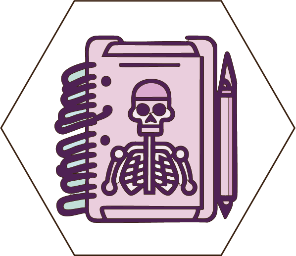

<!-- badges: start -->
[](https://github.com/focardozom/DocumentData/actions/workflows/R-CMD-check.yaml)
<!-- badges: end -->

<p align="left">
  
</p>

# DocumentData

DocumentData is a specialized R package designed for documenting datasets efficiently and effectively. This package streamlines the process of creating comprehensive metadata, ensuring your datasets are well-documented and easier to understand for both current and future use.

# Install

Before installing `DocumentData`, you'll need to have `devtools` in your R setup. If you haven't installed `devtools` yet, you can do so with this command:

```
install.packages("devtools")
```

To install the DocumentData package, run the following code in your R environment:

```
devtools::install_github("focardozom/DocumentData")
```

# Usage Example

Here's a quick example to show you how to use the document_data function. It creates a file right in your working directory. It creates a detailed documentation skeleton for your dataset, formatted in roxygen2 style.

```
the_data <- as.data.frame(datasets::Titanic)
DocumentData::document_data(the_data)
```

Thank you for considering `DocumentData` for your data documentation needs. I hope this tool makes your data management process smoother and more efficient. Should you have any questions, feedback, or suggestions, please feel free to reach out or contribute to the project. Happy documenting!